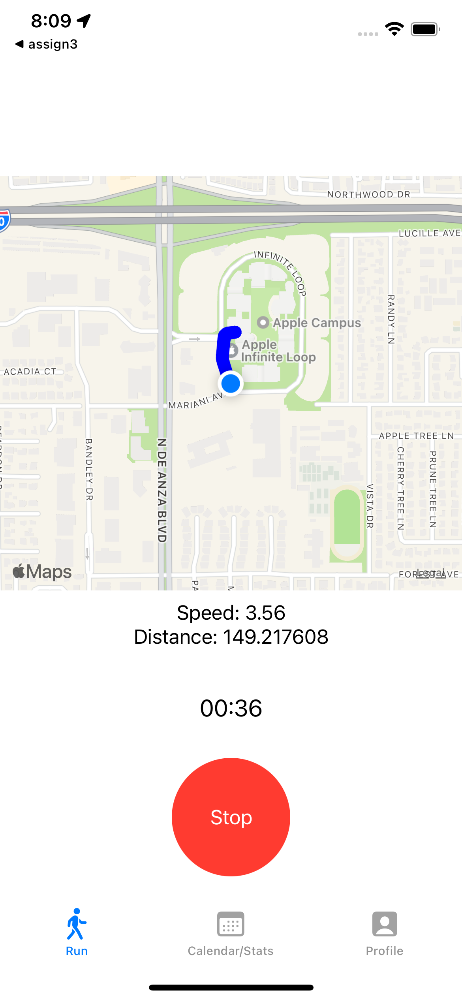
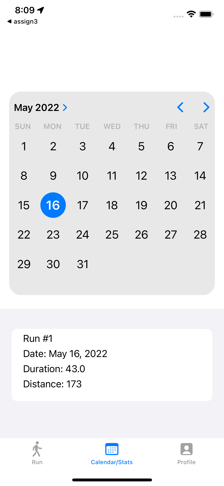
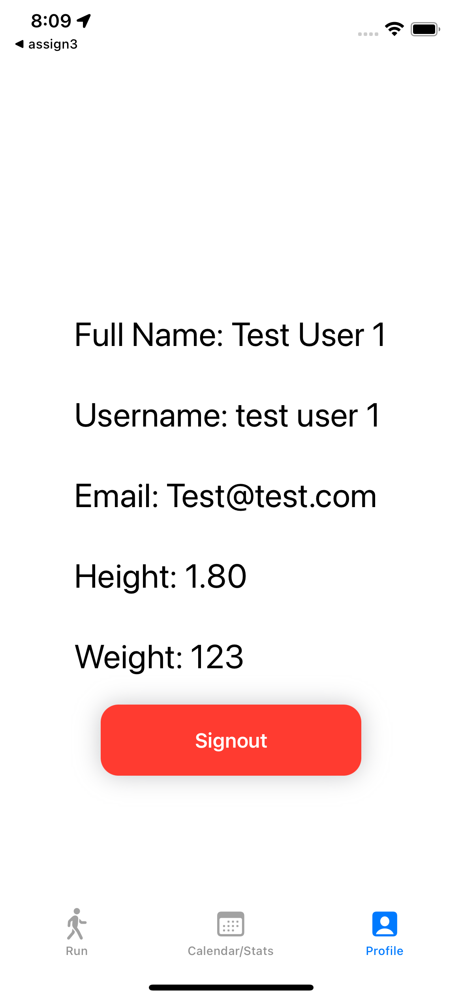

# RunningApp (iOS)

## Overview 
RunningApp is a run-tracking app that allows users to see realtime running route mapping, tracking of distance, and current speed.  This app is backed by FireBase to store user profiles and a user's run data for retrieval using the calendar/stats tab. 

## Screenshots

   
   
   

